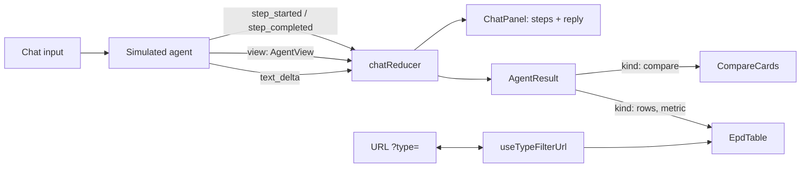

# EPD Explorer

Live link:
https://banazari.github.io/agentic-UX-demo/

A list of Environmental Product Declarations (EPDs) with a URL-synced type filter and a simulated assistant. The assistant answers comparison questions by choosing how the page displays the result.

The assistant is simulated and the ten EPDs are fictional, so it runs anywhere without an API key. Its answers are computed from the data, not stored.

```bash
npm install
npm run dev          # local dev server
npm test             # planner and page tests
npm run build        # static build in dist/
npm run build:single # one self-contained HTML file
```

## What it does

**Type filter**
- Filters on the complete type only (`steel`, not `ste`). Case and surrounding spaces don't matter.
- Applies only when you press **Search** or Enter. Typing does nothing.
- Emptying the field brings the full list back straight away.
- The applied filter lives in the URL (`?type=steel`). A filtered list can be shared, survives a reload, and works with back and forward.

**Assistant**

Paste one of the prompt samples into the chat and send it:

| Prompt | Steps the agent shows | What the page shows |
| --- | --- | --- |
| P1: *Compare GWP of first and second products sorted by lowest A1A2A3 and type steel* | Filter type = steel → sort by GWP A1–A3 → take the first two | Two cards side by side with the same fields as a list row, GWP A1–A3 highlighted and the lower one marked |
| P2: *Find the products in Mexico which have closest entries in GWP luluc* | Filter location = Mexico → compare every pair → pick the closest | Two rows in the normal table, with the GWP total column replaced by GWP-luluc |

Any other prompt gets a reply pointing to the samples. **Back to list** returns to the list. **Show result** on an earlier reply brings its result back.

**Reload** at the top reloads the page. Because the filter is in the URL, a filtered list comes back filtered.

## Architecture



### The agent chooses a view, not markup

The agent never returns HTML. It sends an `AgentView`, a small typed description of what to show:

```ts
type AgentView =
  | { kind: 'compare'; ids: [string, string]; highlight: MetricKey; title; summary }
  | { kind: 'rows'; ids: string[]; metric: MetricKey; title; summary }
```

The page renders it with its own components. That keeps the agent's output safe and on-brand: it can only pick from layouts the frontend supports.

It's also why P2 changes the row layout without a new component. `EpdTable` takes a `metric` prop, `gwpTotal` by default, and the agent asks for `gwpLuluc`.

### Streaming

`runSimulatedAgent` is an async generator. It emits the same kind of events a real agent would send over Server-Sent Events:
- tool steps as they start and finish
- the view
- the reply text word by word

`useAgentChat` feeds them into `chatReducer`. **Stop** aborts the run with an `AbortController`. A new prompt interrupts a reply that's still streaming.

### Planning

`planner.ts` holds the logic as pure functions, tested separately from the UI:
- **P1** filters to steel, sorts by `gwpA1A3` and takes the first two.
- **P2** filters to Mexico, compares every pair and picks the smallest GWP-luluc difference (6 pairs for 4 EPDs).

With a real model, these would be tools the model calls (`filter_epds`, `sort_epds`, `closest_pair`), and the model would decide which to use.

### URL state

`useTypeFilterUrl` reads `?type=` on load, writes it with `history.pushState` only when a search is committed, and listens for `popstate`. If a sandboxed frame refuses history changes, the filter still works and the page shows the link that would reproduce it.

## Data

Ten fictional EPDs, all per declared unit of 1 tonne, each with:
- **GWP total** across all declared modules
- **GWP A1–A3**, the production stage only
- **GWP-luluc**, from land use and land-use change

The timber panel has a negative A1–A3 value because of stored biogenic carbon, which is typical for wood products.

## Things I'd do next

- Let the agent also drive the filter, so its results become shareable links too (for example `?view=compare&ids=b500b,st-60`).
- Connect a real model with tool calling behind a serverless function, streaming over SSE.
- Let the reviewer refine a result in place ("swap the second one for the next lowest").
- Sortable columns and pagination for a real catalogue size.

## Stack

React 19, TypeScript, Vite, Vitest and Testing Library. No UI library.
